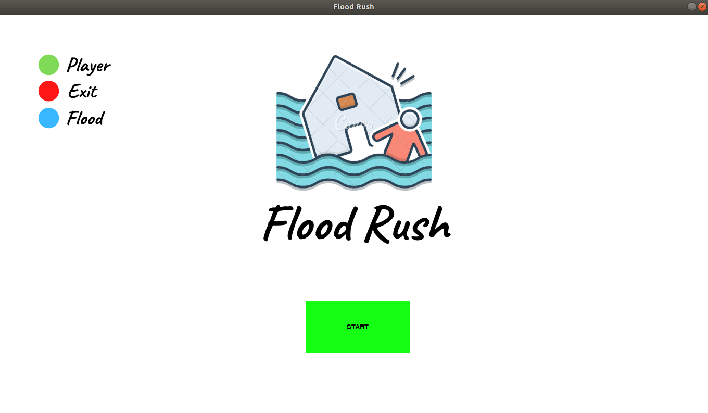

# Flood Rush

**Número da Lista**: 1<br>
**Conteúdo da Disciplina**: Grafos 1<br>

## Alunos
|Matrícula | Aluno |
| -- | -- |
| 17/0129411  |  Guilherme Mendes Pereira |
| 17/0163571 |  Murilo Loiola Dantas |

## Sobre 
Flood Rush é um jogo do gênero *escape*. O prédio está sendo inundado aos poucos e o
objetivo do jogador é encontrar a saída antes que a
inundação o alcance.

## Screenshots
* Menu:



* Jogo em funcionamento + tela de derrota:


* Tela de vitória:


## Instalação 
**Linguagem**: Python<br>
**Pré-requisitos**: [Python](https://www.python.org/downloads/), [pygame](https://www.pygame.org/wiki/GettingStarted) e [pip](https://packaging.python.org/tutorials/installing-packages/).<br>
**Execução do projeto** <br>

* Clone o repositório:
```bash
git clone https://github.com/projeto-de-algoritmos/Grafos1_Flood.git
```
* Acesse o repositório e instale as bibliotecas necessárias:
```bash
cd Grafos1_Flood/
pip3 install -r requirements.txt
```
* Execute o Flood Rush e divirta-se:
```bash
python3 src/game.py
```

## Uso 

### Vídeo explicativo


* Player - verde.
* Saída - vermelho.
* Enchente - azul.

* Clique com o botão esquerdo do mouse em *Start*
* Controle o player com ←, ↑, →,  ↓ do teclado.
* Encontre a saída antes que a enchente alcance o player ou a saída.
* Clique em *Restart* para jogar novamente.
* Clique em *Next* para o próximo nível em caso de vitória.
* Clique em *Quit* para encerrar o jogo.

## Outros 
O jogo possui 7 níveis crescentes de dificuldade.
O grafo gerado a cada fase é aleatório e sempre será fortemente conectado.


